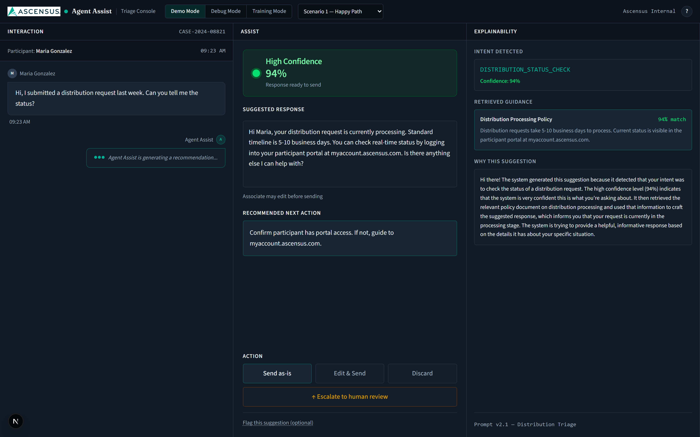
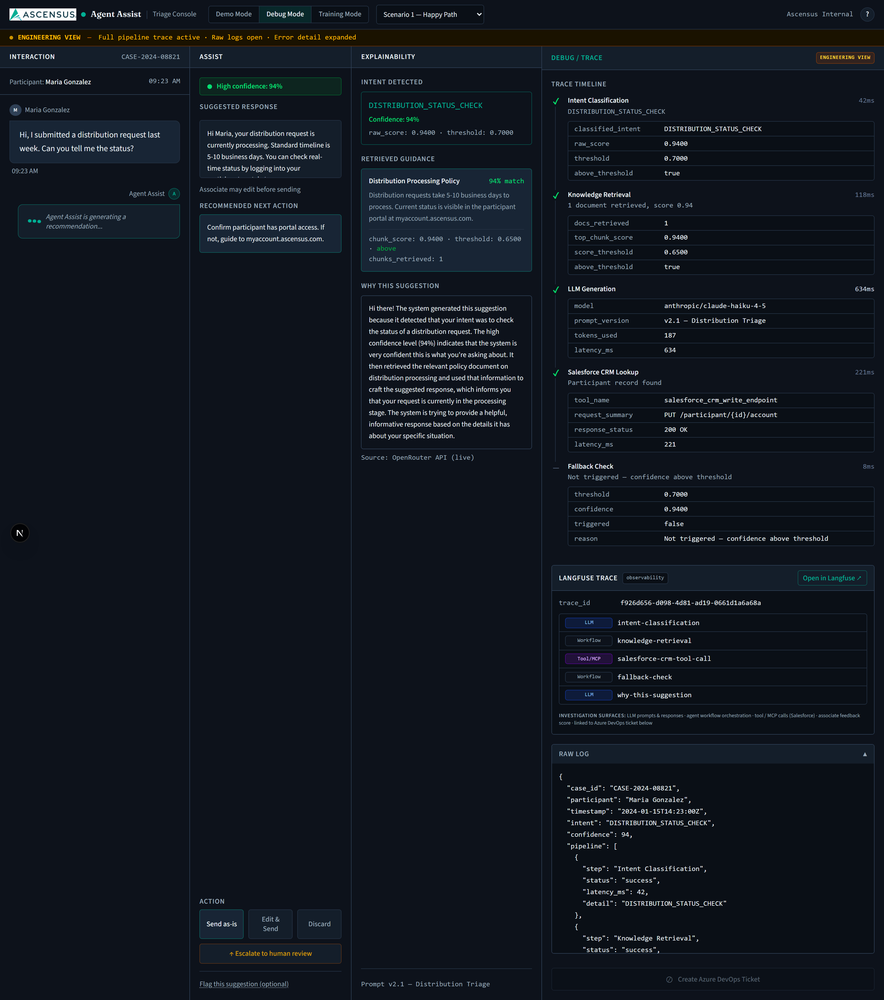
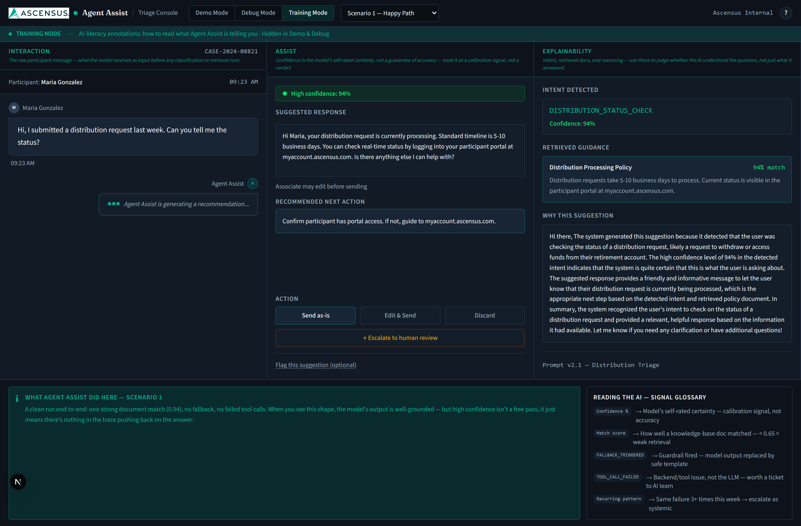
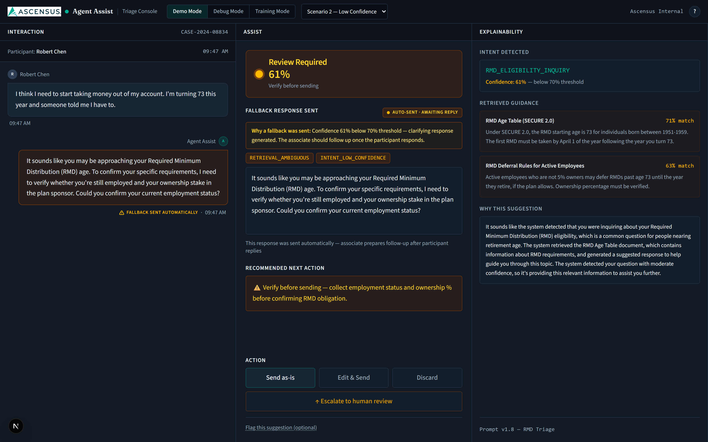
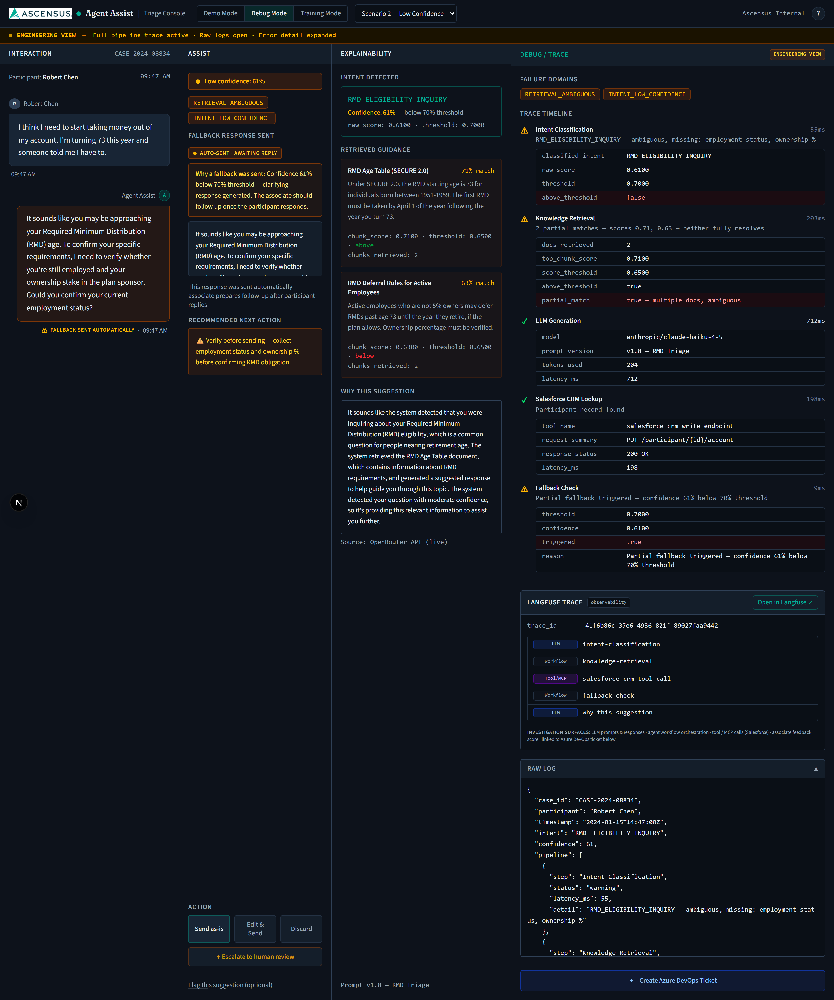
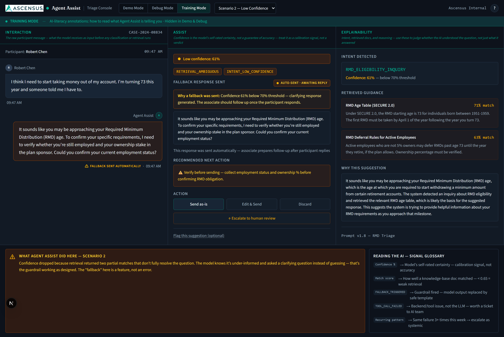
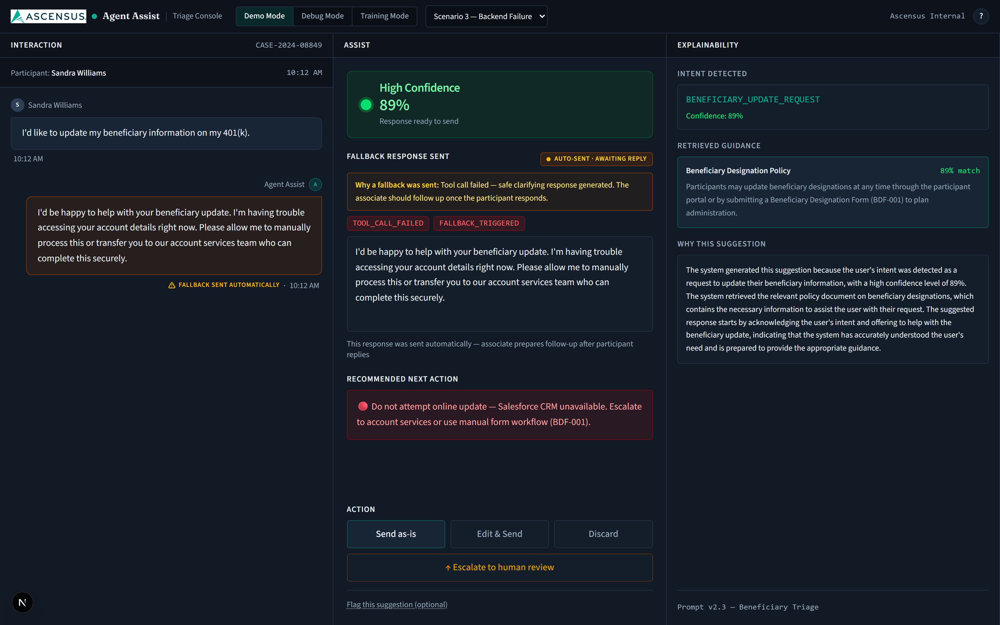
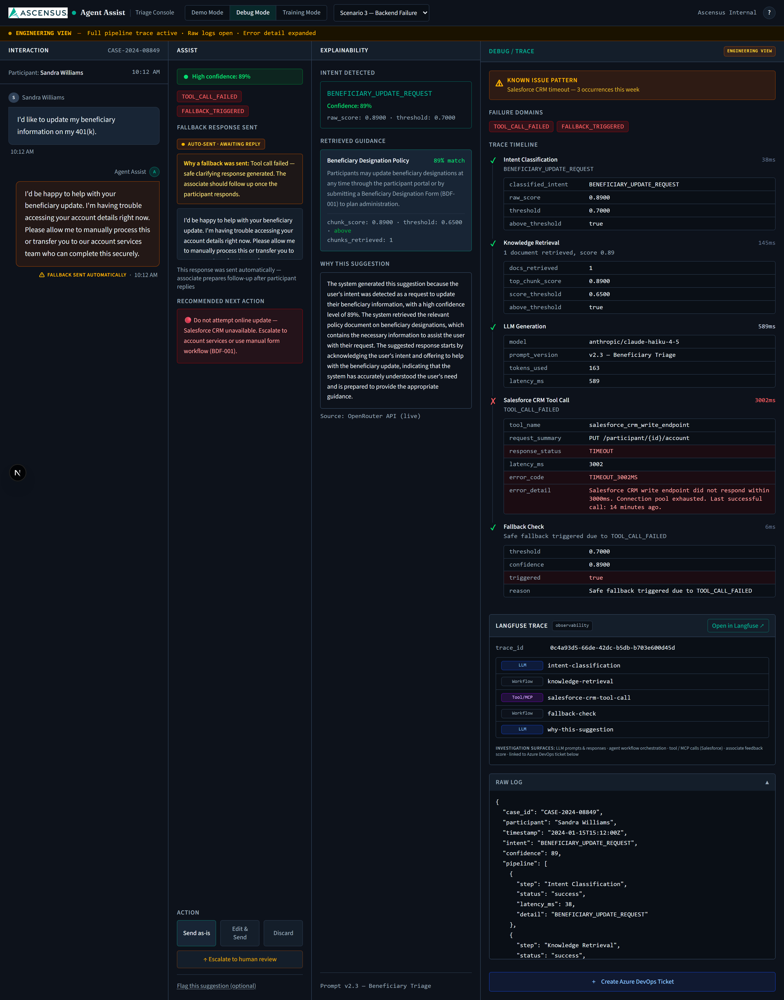
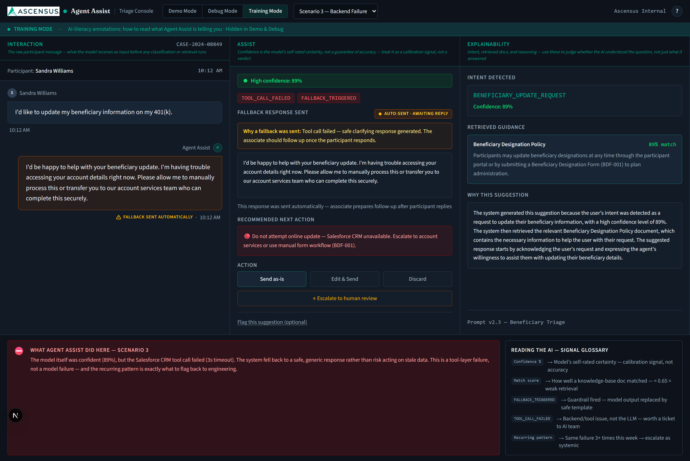

# Agent Assist Triage Console — Live Walk-Through Deck

Interview prep flashcards. Rehearse out loud against each screenshot.

**Flow:** Scenario-first. For each scenario (Happy Path → Low Confidence → Backend Failure) walk through Demo → Debug → Training. This narrates the *spectrum of real cases* an associate handles, then re-renders each one for each audience.

**Total runtime target:** 8–10 minutes if you keep moving, 12 if they interrupt with questions (which they will).

---

## 0. Cold open — before you click anything

> "What I built is an internal Agent Assist console for retirement-plan support associates. The premise is simple: a participant sends a message, a five-step AI pipeline runs in the background, and the associate sees a suggested response — but crucially, they also see *why* the AI is suggesting it, with full confidence and trace data. The whole design is around making the human accountable for the send, not the AI. I'll walk you through three scenarios — easy, ambiguous, broken — and show each through three lenses: what the associate sees, what an engineer sees when triaging, and what a trainer shows a new hire."

Then click into Scenario 1.

---

## 1 ▸ Scenario 1: Happy Path — Demo Mode

**Setup:** Maria Gonzalez asks about a distribution status check. Intent classified at 94% confidence. Three-column clean view — no engineering noise.

**Say:**

> "This is what a support associate sees in production. Maria asks a status question, and Agent Assist returns a 94% high-confidence suggestion. Notice the design hierarchy — the *biggest, most prominent thing on the screen* is the confidence badge. Before the associate reads the suggested response, they already know whether to trust it. Green dot, 'Response ready to send.' The suggested response is grounded in the Distribution Processing Policy doc, which retrieved with a 0.94 similarity score — you can see that on the right.
>
> The 'Why This Suggestion' panel is the trust mechanism. That text isn't fixture data — it's a live LLM call to Claude Haiku via OpenRouter, every page load. The associate can read it, decide it makes sense, and hit Send. Three action paths: send as is, edit then send, or escalate to a human. The associate is always in the loop."

**If they ask:** *Why Haiku?* → "Cheap, fast, sufficient for a 200-token explanation. Model is one string in the API call — I can swap to Sonnet or GPT-4o if I want to compare quality."

---

## 2 ▸ Scenario 1: Happy Path — Debug Mode

**Setup:** Same scenario, engineering view. Four columns: Interaction, Assist, Explainability, full Debug/Trace.

**Say:**

> "This is the same data through an engineer's eyes. The orange banner at the top says 'Engineering View — full pipeline trace active, raw logs open, error detail expanded.' Everything from the demo view is still here, but now I have a fourth column with the complete trace timeline.
>
> Five spans: intent classification 42ms, knowledge retrieval 118ms, LLM generation 634ms, Salesforce CRM lookup 221ms, fallback check 8ms. Each one has expanded debug rows — for retrieval you can see `top_chunk_score: 0.9400`, `score_threshold: 0.6500`, `above_threshold: true`. These aren't decorative — these are the numbers an engineer would need to triage a regression.
>
> At the bottom, that 'Langfuse Trace' panel with the trace_id and the four spans — that's a real Langfuse trace. The 'Open in Langfuse' link goes to the dashboard. Every scenario load creates a real trace server-side. The four spans you see — intent classification, knowledge retrieval, salesforce-crm-tool-call, fallback check — those are synthesized from fixture data to demo the structure. The *fifth* one, `why-this-suggestion`, is the real LLM generation span with real tokens and real latency. Below that, the raw JSON log mirrors what you'd see in production logs."

**If they ask:** *Are the spans real?* → "The pipeline spans are synthesized from fixture data — I'm constructing what production traces would look like. The 'why this suggestion' LLM call is real. That was a deliberate scoping choice for two days — get the *observability shape* right, prove one live LLM call end-to-end, fixtures everywhere else."

---

## 3 ▸ Scenario 1: Happy Path — Training Mode

**Setup:** Same scenario, third audience. Three columns — same as Demo, no engineering panel. Coach's-notes annotations under each header. Bottom drawer: "What Agent Assist Did Here" + "Reading the AI — Signal Glossary."

**Say:**

> "Training mode is *Demo with the volume turned up on teaching*. It is **not** Debug mode with annotations bolted on — that's a deliberate choice. A new associate doesn't need raw JSON logs or Langfuse trace IDs. They need to learn how to read the AI's signals: confidence, match score, fallback reasons. So Training renders the same three columns as Demo, with two additions.
>
> First, each panel header has a one-line coach's note: *'What the associate sees from the participant,' 'Verify before sending — especially under 80% confidence,' 'Use this to explain AI behavior to new associates.'* Second, the bottom drawer is the real teaching surface. 'What Agent Assist Did Here — Scenario 1' explains in plain English what just happened. Next to it, the Signal Glossary defines every signal they're going to encounter — confidence, match score, fallback triggered, tool call failed.
>
> One data model, three audiences, each gets *only* what they need. The associate doesn't see engineering plumbing in Demo *or* Training — that's the point. Engineering data lives in one place: Debug mode."

---

## 4 ▸ Scenario 2: Low Confidence — Demo Mode

**Setup:** Robert Chen, 73, asking about RMDs. Intent 61% confidence — below the 70% threshold. **This is where the system earns its keep.**

**Say:**

> "This is the case that justifies the whole architecture. Robert says he's turning 73 and someone told him he has to start taking money out of his account. Three things make this hard: it's an RMD question, which has regulatory weight; he's still possibly employed, which changes the answer; and the ownership percentage matters for the deferral rules.
>
> The system landed at 61% confidence — amber badge says 'Review Required, verify before sending.' The associate's eye goes there *first*. Then they read the response — and instead of a confident wrong answer, Agent Assist *refuses to commit*. It says 'It sounds like you may be approaching your RMD age. To confirm, I need to verify your employment status and ownership stake.' It asks the clarifying question instead of guessing.
>
> Look at retrieval on the right: two partial matches — the RMD age table at 71% and the deferral rules at 63%. Neither one alone resolves the question. The system *knew* it didn't know, and routed to a fallback clarifying response. The amber-bordered 'Why a fallback was sent' panel and the 'Verify before sending — collect employment status and ownership %' next-action makes the associate's job explicit.
>
> This is the failure mode I'm most proud of. The cost of a confident wrong RMD answer is a tax penalty for the participant and a regulatory headache for Ascensus. The cost of a clarifying question is twelve more seconds on the call."

**If they ask:** *Why 70%?* → "Starting heuristic. In production, you'd tune it per intent class from labeled data — false positive rate of confident-wrong vs. false negative rate of over-escalation. 70% gives me a visible amber zone for the demo."

---

## 5 ▸ Scenario 2: Low Confidence — Debug Mode

**Setup:** Engineering view of the same case. Now you can show the *quantitative* picture of ambiguity.

**Say:**

> "Same scenario, engineering view. Look at the failure domain tags up top — `RETRIEVAL_AMBIGUOUS` and `INTENT_LOW_CONFIDENCE`. Those aren't UI labels, those are the actionable categories. If we saw a spike of `RETRIEVAL_AMBIGUOUS` tagged scenarios this week, that tells engineering: the knowledge base coverage for RMDs is incomplete, or the chunking strategy needs revisiting.
>
> Intent step has a warning icon. Look at the expanded debug rows — `raw_score: 0.6100`, `threshold: 0.7000`, `above_threshold: false` highlighted red. The retrieval step shows two docs returned with `partial_match: true — multiple docs, ambiguous`. The fallback step at the bottom: `triggered: true`, reason: `Partial fallback triggered — confidence 61% below 70% threshold`.
>
> The Langfuse trace panel still shows all spans. If I were on call and someone flagged this trace, I have everything I need: intent score, retrieved chunks, fallback reason, suggested response, and the associate's eventual feedback — all in one Langfuse trace, all queryable."

---

## 6 ▸ Scenario 2: Low Confidence — Training Mode

**Setup:** Same three columns. Failure tags `RETRIEVAL_AMBIGUOUS` and `INTENT_LOW_CONFIDENCE` are visible inline with the response — those are *associate-facing* signals, not engineering plumbing. Training drawer reframes ambiguity as a *feature*, not a defect.

**Say:**

> "Look at where the failure tags surface — inline with the suggested response, in the Assist panel itself. That's intentional. `RETRIEVAL_AMBIGUOUS` and `INTENT_LOW_CONFIDENCE` are part of the associate's language now — they're learning to read these as signals, the same way they'd read a confidence percentage. The training drawer at the bottom tells them why it matters: *'Confidence dropped because retrieved documents don't fully resolve the question. The model knows it's under-informed and asked a clarifying question instead of guessing — that's the guardrail working as designed. The fallback here is a feature, not an error.'*
>
> That's the framing I want a new associate to internalize. When a fallback fires, their instinct shouldn't be 'the AI broke' — it should be 'the AI is doing its job, recognizing its limits, and now I need to ask my clarifying question.' The Signal Glossary on the right gives them the vocabulary."

---

## 7 ▸ Scenario 3: Backend Failure — Demo Mode

**Setup:** Sandra Williams wants to update her beneficiary. 89% confidence — high! — but Salesforce timed out.

**Say:**

> "This is the most subtle failure mode. Sandra asks to update her beneficiary. Confidence is 89% — high green. The retrieval returned the right doc — Beneficiary Designation Policy, 89% match. By the AI's standards, this should be a clean send.
>
> But the Salesforce CRM tool call *failed* — timed out at 3002ms. We can't safely write the update online because we never confirmed her account state. So instead of letting the LLM generate a 'sure, I updated it' confident wrong answer, the fallback fired. The suggested response says 'I'm having trouble accessing your account details right now. Please allow me to manually process this or transfer you to our account services team.' Safe, honest, and routes the participant to a path that actually works.
>
> Notice the failure tags inline with the response — `TOOL_CALL_FAILED`, `FALLBACK_TRIGGERED`. Red banner under the suggested response says 'fallback sent — safe clarifying response generated.' The next action is red: 'Do not attempt online update — Salesforce CRM unavailable. Escalate to account services or use manual form workflow, form BDF-001.'
>
> The key insight: high confidence in the *language model* does not mean it's safe to act. The pipeline has multiple guardrails, and tool failures are first-class citizens. The LLM is one component, not the whole brain."

---

## 8 ▸ Scenario 3: Backend Failure — Debug Mode

**Setup:** This is the *killer slide for engineering audiences*. Bring it up confidently.

**Say:**

> "This is the screen I'd want if I were on call. Known issue pattern banner at the top — *'Salesforce CRM timeout — three occurrences this week.'* That's a tag the system applies when the same failure has happened more than once. It signals: this isn't a one-off, this is a *systemic issue* that should be escalated to platform engineering, not handled case-by-case.
>
> Failure domain tags: `TOOL_CALL_FAILED`, `FALLBACK_TRIGGERED`. Trace timeline shows intent succeeded, retrieval succeeded, LLM generation succeeded — and then the Salesforce CRM tool call has a red X. Expanded debug rows show `tool_name: salesforce_crm_write_endpoint`, `response_status: TIMEOUT`, `latency_ms: 3002`, `error_code: TIMEOUT_3002MS`, and `error_detail: Salesforce CRM write endpoint did not respond within 3000ms. Connection pool exhausted. Last successful call: 14 minutes ago.* That's the kind of error detail that lets an engineer skip straight to the right hypothesis.
>
> At the bottom — see the 'Create Azure DevOps Ticket' button? That opens a pre-filled work item with the trace ID, repro steps, expected vs. actual, frequency line that pulls in the known issue pattern, suggested owner Platform Engineering, priority P2. In production, that button would actually file the ticket against the Azure DevOps API. Today it copies to clipboard. The workflow is the point: engineer hits the failed scenario, one click files the bug with all the trace context already attached."

**If they ask:** *How do you decide P2 vs P3?* → "Heuristic in the prototype: if a fallback fired or a tool failed, P2. If only confidence is low, P3. In production that's a learned routing policy, probably tied to the failure-domain tag plus historical SLA impact."

---

## 9 ▸ Scenario 3: Backend Failure — Training Mode

**Setup:** Final view. Tool-layer failure tags `TOOL_CALL_FAILED` and `FALLBACK_TRIGGERED` shown inline. Training drawer teaches the *category of failure*.

**Say:**

> "Final view, and the most important teaching case. Notice what the associate sees: high confidence — 89% — *and* failure tags. That combination is counterintuitive. The training drawer at the bottom explains it: *'The model itself was confident, 89%, but the Salesforce CRM tool call failed in 3002ms. The system fell back to a safe, generic response rather than acting on stale data. This is a tool-layer failure, not a model failure — and the recurring pattern is exactly what to flag to engineering.'*
>
> That distinction matters. When something breaks, new associates need to know *which layer broke* so they escalate correctly. Three failure layers in this system: intent can be ambiguous, retrieval can be incomplete, tool calls can fail. Training teaches the associate to read which one — so when they escalate, they say 'Salesforce timed out three times today' instead of 'the AI is broken.' That's the difference between a useful escalation and a noisy one."

---

## Close

> "Three scenarios, three audiences, one data model. The architecture is intentionally simple: a five-step pipeline with explicit failure modes, server-side observability through Langfuse, and a UI that adapts fidelity to who's looking. In production, the fixtures become real services — real RAG, real Salesforce MCP-style tool calls — but the *shape* of the pipeline and the *shape* of the trust mechanism are designed to scale.
>
> The thing I'd want a VP of AI to take away: assist, don't act. Explain everything. Observe everything. The AI's job is to make the human faster and safer — not to replace the human's judgment. Especially in regulated workflows, that distinction is the whole product."

---

## Pocket cheat sheet — for when they interrupt

| If they ask… | Say… |
|---|---|
| Real or mocked? | "Pipeline spans synthesized from fixtures; the 'Why This Suggestion' LLM call and the Langfuse traces are real. Deliberate scoping for a 2-day build." |
| Why Langfuse over OpenTelemetry? | "Langfuse is LLM-native — generation spans understand tokens, prompts, model versions. OTel is generic. For a prototype focused on AI observability, Langfuse is the right starting point." |
| Why three modes vs. role-based auth? | "Mode toggle is for the demo. In production these would be role-gated — associates can't see Debug, engineers and trainers have access to their respective views." |
| What about PII? | "Synthetic names in fixtures. Production traces need PII scrubbing — participant names, case IDs, message content all need to be redacted or hashed before they leave the boundary." |
| How long did this take? | "Two days end to end. Most of the time was on the failure-mode design and the three-audience framing. Implementation is mostly fixtures plus one real LLM call wired through Langfuse." |
| What would you change? | "Real RAG over Ascensus policy docs. Real Salesforce sandbox. Close the feedback loop — Langfuse scores feeding a weekly prompt-tuning review. And wire the Azure DevOps button to actually file tickets." |

---

## Drill order

1. **Cold pass:** read top to bottom, no notes, time yourself. Goal: under 10 minutes.
2. **Random pass:** have someone pick a slide number. Talk to it without context.
3. **Reverse pass:** walk it backward (close → scenario 3 → scenario 2 → scenario 1 → cold open). Tests dataflow understanding.
4. **Adversarial pass:** every time you finish a slide, ask yourself "what would I challenge here if I were a VP of AI?" and answer it.
